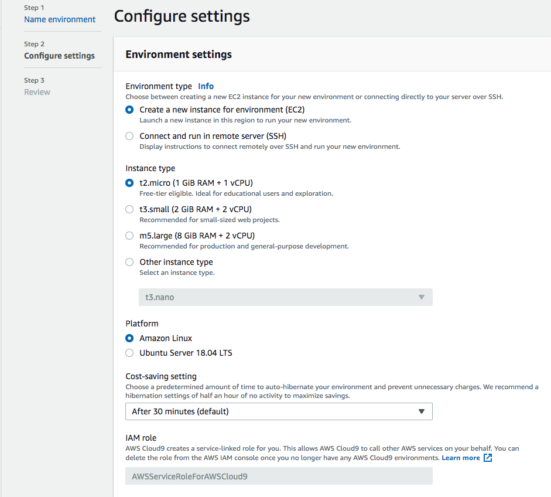

# Create Cloud9 Environment

## Log in to your AWS Account Console and search for Cloud9

## Create New Environment

- name your environment and provide a description, then press *Next step*

- use t2.micro instance
- set up auto-hibernate option
- press *Next step*

- review and press *Create environment*

## Open new Terminal window

## Next Step

## [Install the ESP32 toolchain]({{ "/lab0/toolchainsetup.html" | absolute_url }})
