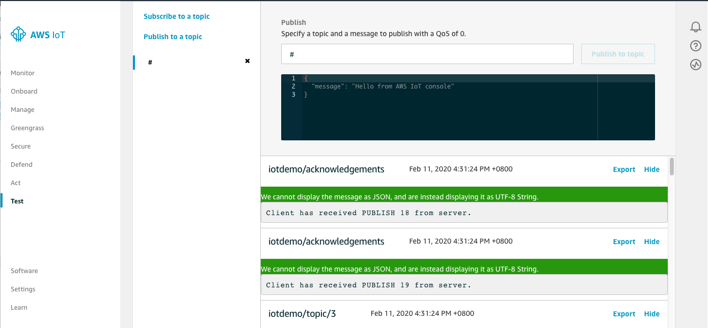

# Monitoring MQTT Messages on the Cloud

You can use the MQTT client in the AWS IoT console to monitor the messages that your device sends to the AWS Cloud.

## To subscribe to the MQTT topic with the AWS IoT MQTT client
1. Sign in to the [AWS IoT console](https://console.aws.amazon.com/iotv2/).

2. In the navigation pane, choose Test to open the MQTT client.

3. In Subscription topic, enter `#`, and then choose Subscribe to topic.

## Next Step

[BACK]({{ "/" | absolute_url }})