<!--more-->

# Lab2: Just in Time Registeration with Greengrass

## overview

In this lab you will:

1. Create an EC2 instance

2. Install[AWS CLI](https://docs.aws.amazon.com/cli/latest/userguide/cli-chap-install.html)and [configure](https://docs.aws.amazon.com/cli/latest/userguide/cli-chap-configure.html) on the EC2 instance you've created

3. Use openssl on EC2 to create your certs and import your CA to AWS IoT

4. Create a lambda function and IoT Action to provision Greengrass in AWS IoT

5. Install and start greengrass with the certs you've created in **step 3**

6. Verifiy in AWS IoT Console that the group is successfully created/provisioned and then deploy the greengrass group


# Create an EC2 instance

## starting by launching your EC2 instance

1. naviage to EC2 console as following
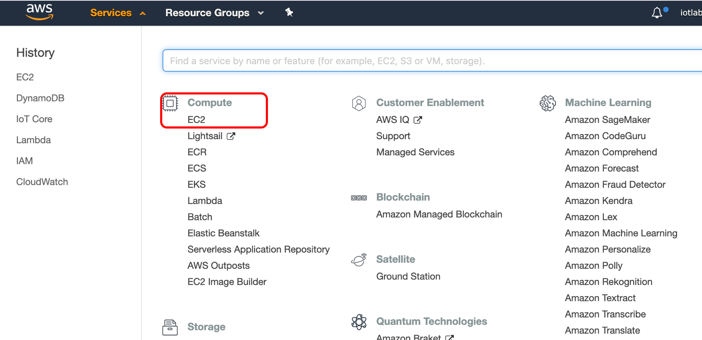

2. launch your EC2 instance
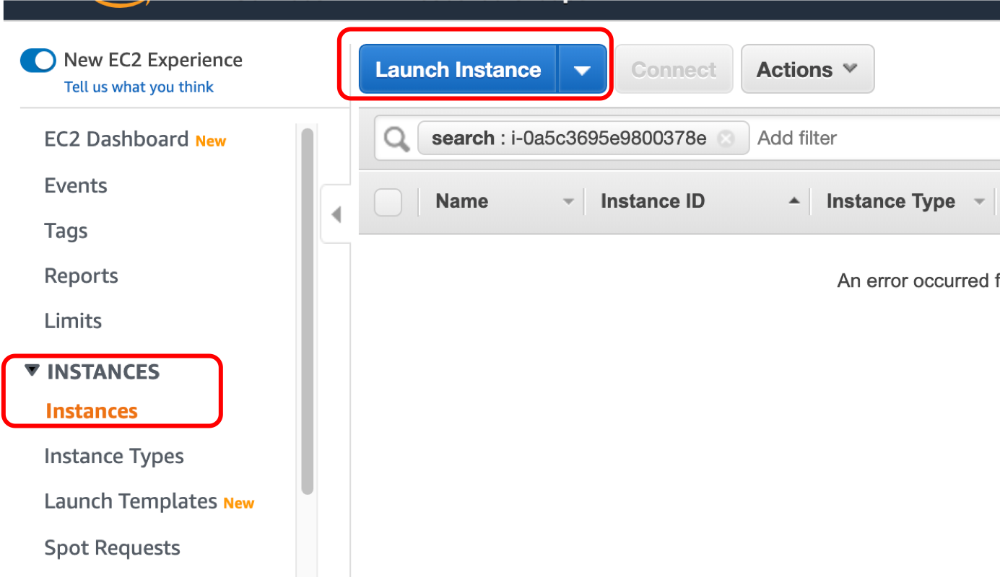

3. slelect ubuntu image for your EC2 machine
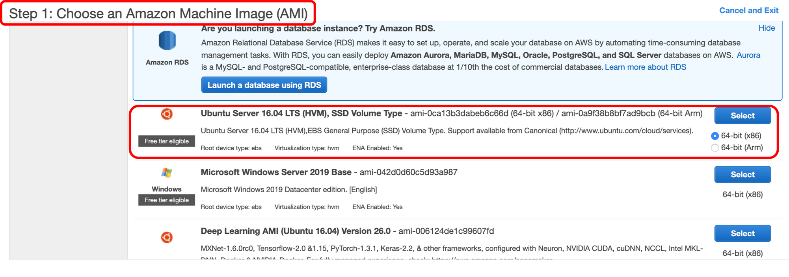

4. walk through the setup for your EC2
   
- step 2: Choose Instance Type : t2.micro then click **review and launch**
- Step 7: Review Instance Launch

5. Save key and launch


# Install AWS CLI on the EC2

## starting by launching your EC2 instance

1. connect, login to your EC2 instance

Connect to your Amazon EC2 instance.

In the navigation pane, choose Instances, choose your instance, and then choose Connect.

Follow the instructions on the Connect To Your Instance page to connect to your instance by using SSH and your private key file.

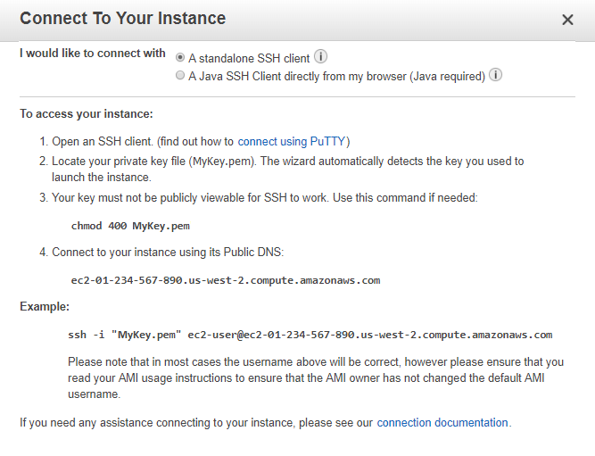

You can use PuTTY for Windows or Terminal for macOS. For more information, see Connect to Your Linux Instance in the Amazon EC2 User Guide for Linux Instances.

2. Install[AWS CLI](https://docs.aws.amazon.com/cli/latest/userguide/install-linux.html)

```
aws cli
```
in the terminal, input above cmd and check if the following menue prompts

 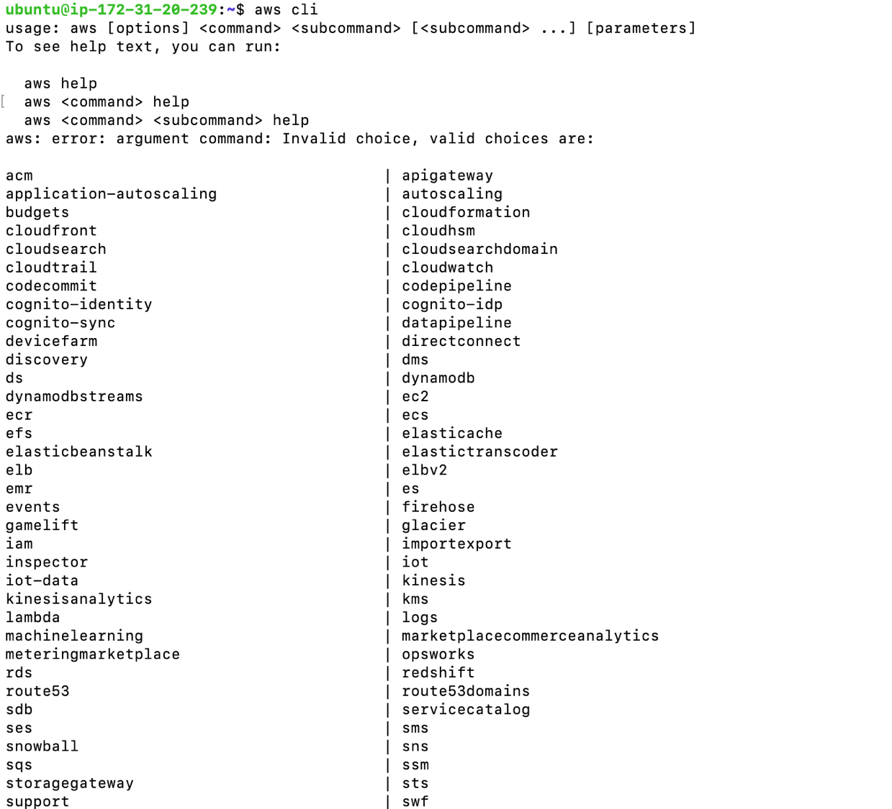

3. [aws configure](https://docs.aws.amazon.com/cli/latest/userguide/acli-chap-configure.html) 

make sure when your aws creadentials and configure are prperly set

```
ubuntu@ip-172-31-20-239:~$ cat ~/.aws/credentials 
[default]
aws_access_key_id = XXXXXYour_IAM_user_key_idXXXXXX
aws_secret_access_key = XXXXXYour_IAM_user_keyXXXXXX
ubuntu@ip-172-31-20-239:~$ cat ~/.aws/config 
[default]
output = text
region = ap-southeast-1
```

# Use openssl on EC2 to create your certs and import your CA to AWS IoT

You will do the following on your **EC2 machine**:

0. loging to your EC2 machine created in **step1**
1. Create, register, and activate a CA certificate that will be used to sign your device certificate.
2. Enable auto-registration of certificates.
3. Create device certificates signed by the CA and install them on your device.


## Registering Your CA Certificate

Let’s start by using openssl in a terminal to create your sample CA certificate. This sample CA certificate is used later in the walkthrough to sign a device certificate that you register with AWS IoT:

```
$ openssl genrsa -out sampleCACertificate.key 2048
$ openssl req -x509 -new -nodes -key sampleCACertificate.key -sha256 -days 365 -out sampleCACertificate.pem -extensions v3_ca
```

The registration workflow first requires retrieving the registration code. You can use the AWS CLI or the Register Certificate section in the AWS IoT console to get the registration code.

```
$ aws iot get-registration-code
```

This command will return a randomly generated, unique registration code that is bound to your AWS account. This registration code is long-lived. It does not expire until you delete it.

```
$ openssl genrsa -out privateKeyVerification.key 2048
$ openssl req -new -key privateKeyVerification.key -out privateKeyVerification.csr
```

During the CSR creation process, you will be prompted for information. Enter the registration code into the Common Name field of the verification certificate:

```
...
Organization Name (eg, company) []:
Organizational Unit Name (eg, section)
Common Name (e.g. server FQDN or YOUR name) []: XXXXXSAMPLEREGISTRATIONCODEXXXXX
EMAIL ADDRESS []:
```

The registration code establishes that the generated verification certificate was created specifically for registering the CA certificate with AWS IoT, and that the verification certificate is not a previously issued certificate.

Now that you have a CSR that includes the registration code, use your first sample CA certificate and the CSR to create a new certificate:

```
$ openssl x509 -req -in privateKeyVerification.csr -CA sampleCACertificate.pem -CAkey sampleCACertificate.key -CAcreateserial -out privateKeyVerification.crt -days 365 -sha256
```


Next, you will use the verification certificate to register your sample CA certificate:

```
$ aws iot register-ca-certificate --ca-certificate file://sampleCACertificate.pem --verification-certificate file://privateKeyVerification.crt
```

You can make a describe-ca-certificate call to get the information on the registered CA certificate. 

```
$ aws iot describe-ca-certificate --certificate-id <certificateId>
```

Next, you will activate the CA certificate with following cmd

```
$ aws iot update-ca-certificate --certificate-id <certificateId> --new-status ACTIVE
```
By default, the auto-registration-status of the registered CA certificate is disabled, use following cmd to enable the auto-registration-status 

```
$ aws iot update-ca-certificate --certificate-id <caCertificateId> --new-auto-registration-status ENABLE
```

## Create Device Certificate Signed by Your CA Certificate

Enter the following commands in your terminal to create a device certificate:

```
$ openssl genrsa -out deviceCert.key 2048
$ openssl req -new -key deviceCert.key -out deviceCert.csr
$ openssl x509 -req -in deviceCert.csr -CA sampleCACertificate.pem -CAkey sampleCACertificate.key -CAcreateserial -out deviceCert.crt -days 365 -sha256
```

Create a certificate file that contains the device certificate and its registered CA certificate. Here is the Linux command:

```
$ cat deviceCert.crt sampleCACertificate.pem > deviceCertAndCACert.crt
```


# Create a lambda function and IoT Action to provision Greengrass in AWS IoT

you will do the following:

1. create a policy for your lambdafunction role
2. create a role and attach the policy you've created
3. create a lambda function with the role you've created
4. create a rule(Act) in AWS IoT


## create a policy for your lambdafunction role

First, loging to IAM

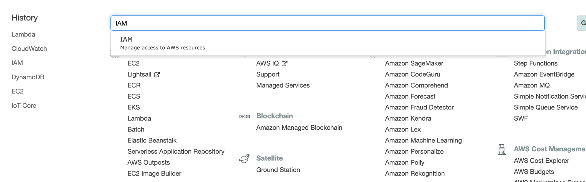


Now, let's start with create the policy

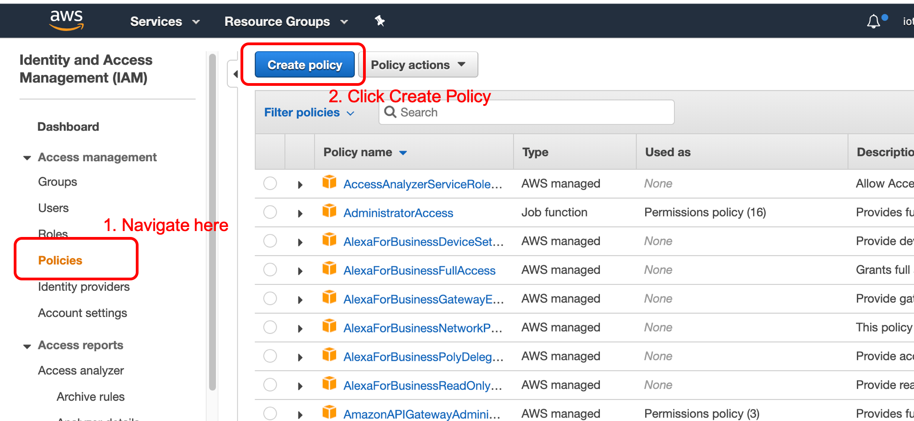

Next, input the policy template 
- (please noted that there permission here is for workshop purpose, and if you would like to give access for lambda to output log in CloudWatch, you will need to give further acess)

```
{
    "Version": "2012-10-17",
    "Statement": [
        {
            "Effect": "Allow",
            "Action": [
                "iot:*",
                "greengrass:*"
            ],
            "Resource": "*"
        }
    ]
}
```

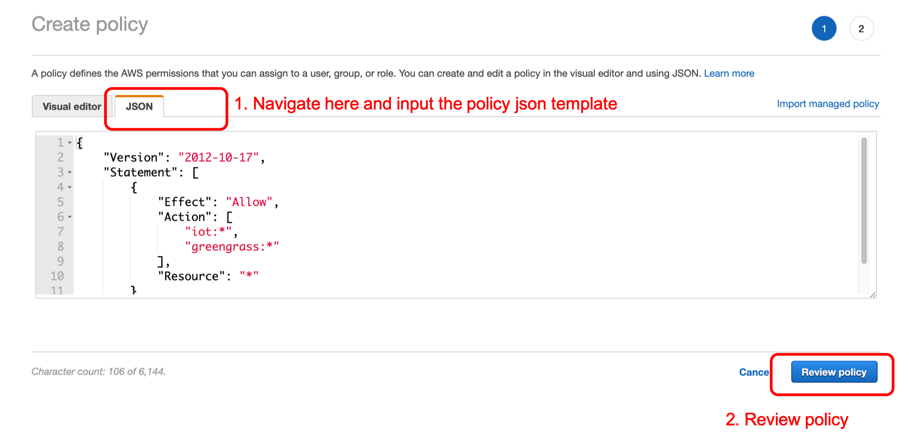


Next, in the Review policy page:

**Name** input **greengrass_provision_policy** and clikc **Create Policy**

Finally, verifiy your policy

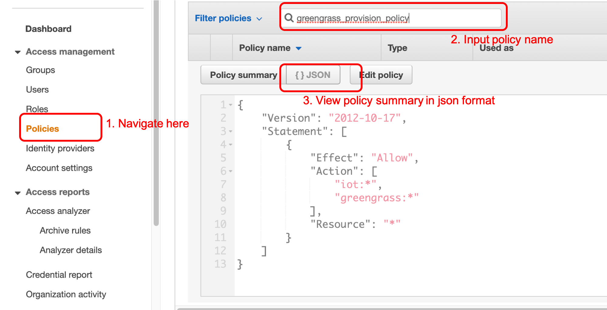


## create a role and attach the policy you've created

like the first few steps in creating policy, first login to IAM, and this time navigate to **Roles** and click **Create role**

Next, **Choose a use case**
Make sure you've choosed Lambda, it should look like this

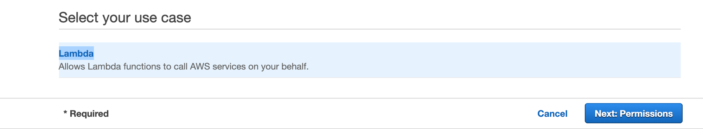

Click Next: Permissions
attach **greengrass_provision_policy** and click **Next: Tags**

Keep it blanked and click **Next: Review**

**Role name** input **greengrass_provision_role** and click **Create role**

Now, verify your role, it should have **greengrass_provision_policy**

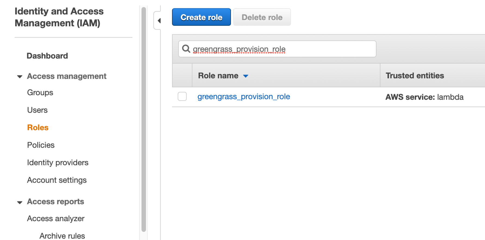


## create a lambda function with the role you've created

- Sign in to the AWS Management Console and open the AWS Lambda console 
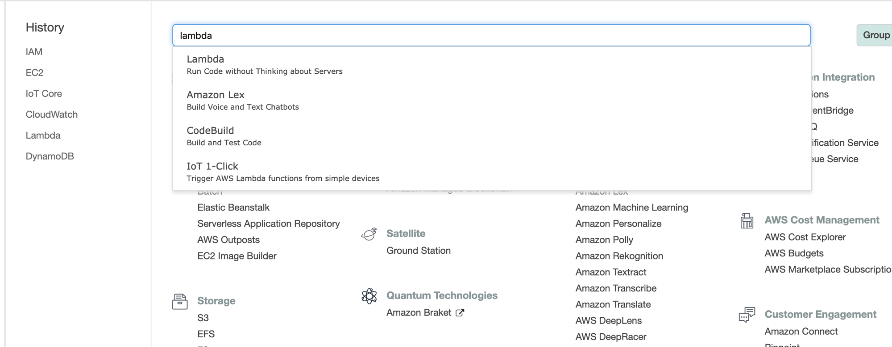
- Choose Create an AWS Lambda function.
- On the Configure function page, type a name (**jitr-gg-create-lambda**) and description for the AWS Lambda function. In Runtime, choose python 3.6 or 3.8.

- Scroll down to the AWS Lambda function handler and role section of the page. For Role, choose **Use an existing role**. And in **Existing role**, scroll down and choose **greengrass_provision_role** and click create
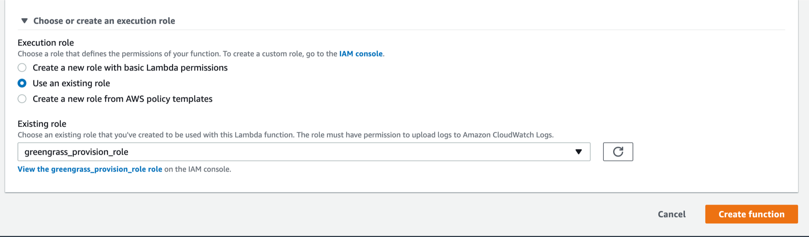
- At this point, a lambdafunction is created, and it should looks like the following 
- - please noted that at this point the lambda function has no trigger source, it will be updated after the IoT rule is created
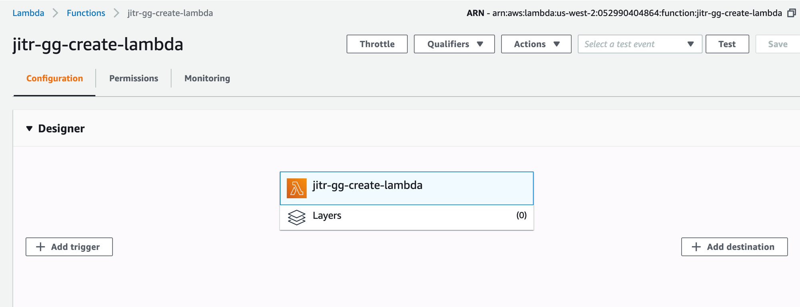
- Scroll down to the AWS Lambda function code section of the page. Replace the existing code with the following code, and click **Save**
    ```
import json
import boto3
import time
from botocore.exceptions import ClientError

iot = boto3.client('iot', region_name='ap-southeast-1')
dynamodb = boto3.client('dynamodb')
gg = boto3.client('greengrass', region_name='ap-southeast-1')

policy = {
"Version": "2012-10-17",
"Statement": [
    {
    "Effect": "Allow",
    "Action": [
        "iot:Publish",
        "iot:Subscribe",
        "iot:Connect",
        "iot:Receive"
    ],
    "Resource": [
        "*"
    ]
    },
    {
    "Effect": "Allow",
    "Action": [
        "iot:GetThingShadow",
        "iot:UpdateThingShadow",
        "iot:DeleteThingShadow"
    ],
    "Resource": [
        "*"
    ]
    },
    {
    "Effect": "Allow",
    "Action": [
        "greengrass:*"
    ],
    "Resource": [
        "*"
    ]
    }
]
}
def delete_cert_and_policy(deviceId, principals):
    for principal in principals:
        certificateId = principal.split('/')[-1]
        policies = iot.list_attached_policies(target=principal)
        for policy in policies['policies']:
            iot.detach_policy(
                policyName=policy['policyName'], target=principal
            )
            iot.delete_policy(policyName=policy['policyName'])
        iot.update_certificate(
            certificateId=certificateId, newStatus='INACTIVE'
        )
        iot.detach_thing_principal(
            thingName=deviceId,
            principal=principal
        )
    while True:
        resp = iotClient.list_thing_principals(
            thingName=deviceId
        )
        if not resp['principals']:
            break
        time.sleep(1)

def lambda_handler(event, context):
    global policy
    print("event:  ", event)
    certId = event['certificateId']
    response = iot.describe_certificate(
        certificateId=certId)
    certificatePem = response['certificateDescription']['certificatePem']
    print(certificatePem)
    deviceId = 'device_jitr'  + '_0309_workshop'
    certificateArn = response['certificateDescription']['certificateArn']

    # create thing
    try:
        response = iot.describe_thing(
            thingName=deviceId
        )
    except ClientError as e:
        response = iot.create_thing(
            thingName=deviceId
        )
    thingArn = response['thingArn']

    # delete certificates which are attached to this thing
    response = iot.list_thing_principals(
        thingName=deviceId
    )
    if response['principals']:
        delete_cert_and_policy(deviceId, response['principals'])

    # generate keys and certificate
    response = iot.describe_certificate(
        certificateId=certId)
    certificatePem = response['certificateDescription']['certificatePem']
    certificateArn = response['certificateDescription']['certificateArn']


    # attach certificate to thing
    policyDocument = json.dumps(policy)
    iot.attach_thing_principal(
        thingName=deviceId,
        principal=certificateArn
    )

    try:
        # create a policy for thing
        policyName = 'Policy_' + deviceId
        iot.create_policy(
            policyName=policyName,
            policyDocument=policyDocument
        )
    except ClientError as e:
        print('policy exists', policyName)
        raise(e)


    try:
        # attach policy to certificate
        iot.attach_policy(
            policyName=policyName,
            target=certificateArn
        )
    except ClientError as e:
        print('attach policy  failed')


    iot.update_certificate(
        certificateId=certId,                
        newStatus='ACTIVE'
    )

    # creating Greengrass group steps:
    # 1. create_thing as avoce
    # 2. create_core_definition
    # 3. create group
    # 4. create group version
    groupName = 'jitr_group_' + deviceId

    try:
        response = gg.get_group(GroupId=groupName)
        print(groupName, 'exists')
    except ClientError as e:
        print(groupName, 'not exists, create one')
        coreDefDeviceId = 'gg_core_' + deviceId
        response = gg.create_core_definition(
            InitialVersion={
                'Cores': [
                    {
                        'CertificateArn': certificateArn,
                        'Id': deviceId,
                        'SyncShadow': True,
                        'ThingArn': thingArn
                    },
                ]
            },
            Name=coreDefDeviceId
        )
        print(response)

        CoreDefinitionVersionArn = response['LatestVersionArn']
        print(CoreDefinitionVersionArn)

        time.sleep(10)


        group_info = gg.create_group(Name=groupName)
        group_args = {'GroupId': group_info['Id']}
        group_args['CoreDefinitionVersionArn'] = CoreDefinitionVersionArn

        grp = gg.create_group_version(
                    **group_args
                )
        print(grp)
    ```
    it should look like the following
    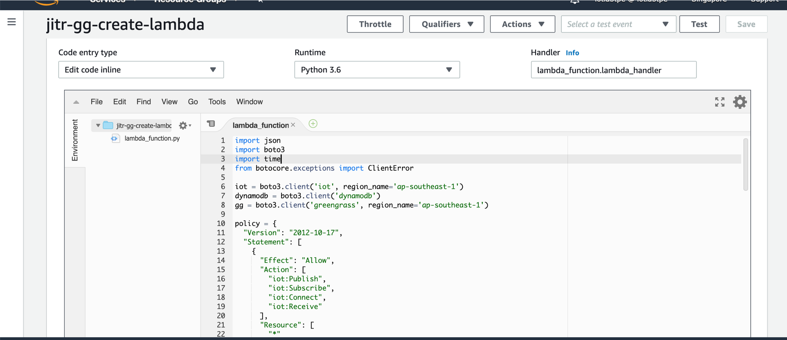

- Now, scroll down and edit the **basic settings**, edite and update the **Timeout** to more then 30 seconds as following:
    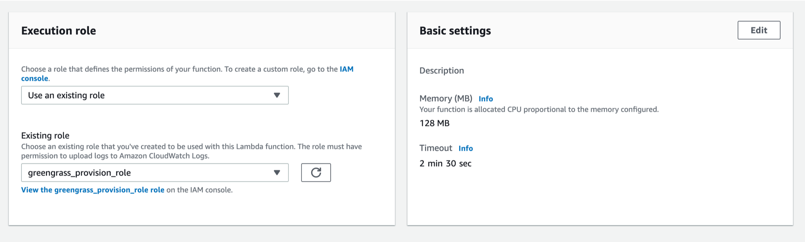
click **Save**


## create a rule(Act) in AWS IoT


Now that you have created an AWS Lambda function, you can create a rule that invokes the function.

- In the AWS IoT console, navigate to **Act**.
- Choose Create a rule.
- Type a name and description for the rule.
    Enter the following settings for the rule:
    SQL version: 2016-03-23-beta
    Attribute: *
    Topic filter: $aws/events/certificates/registered/<caCertificateID> Note: Replace <caCertificateId> with the ID of the registered CA certificate.
- For Choose an action, choose Insert this message into a code function and execute it (AWS Lambda).
- From Function name, choose your AWS Lambda function name you've created in the previous section(**jitr-gg-create-lambda**), and then choose Add action.
- Choose Create to create your AWS Lambda function.

it shoud look like the following
in the rule page:
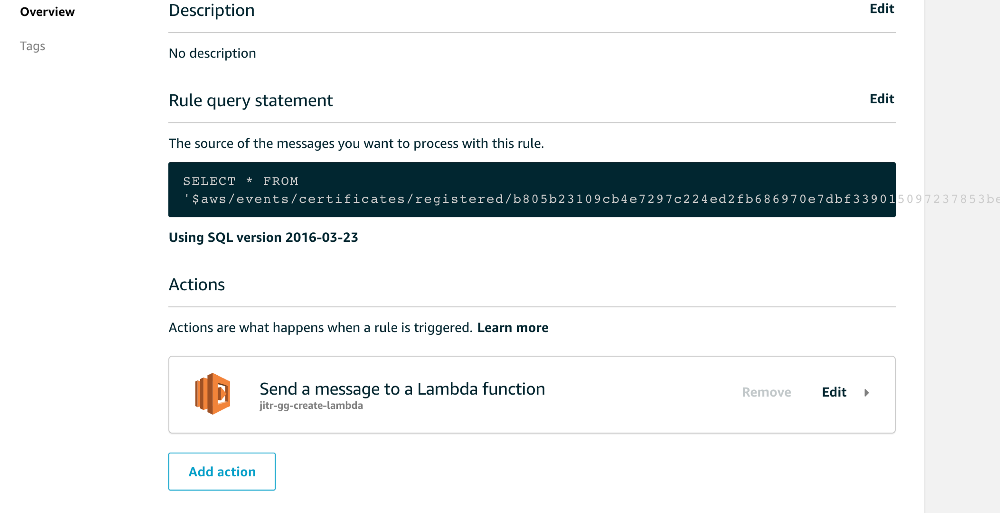
in the Act page
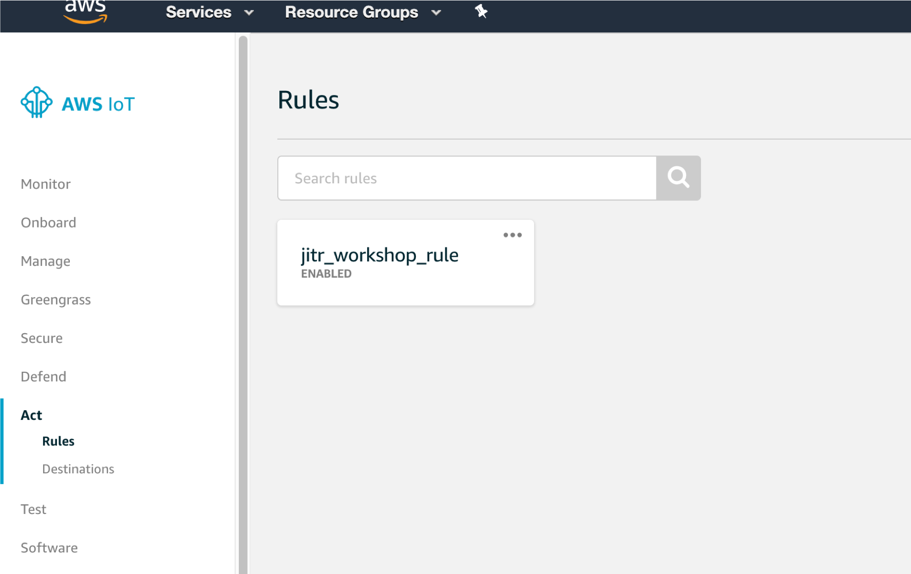

You can also navigate back to the lambda function you've created, you will noticed that the lambda function has a trigger source with AWS IoT

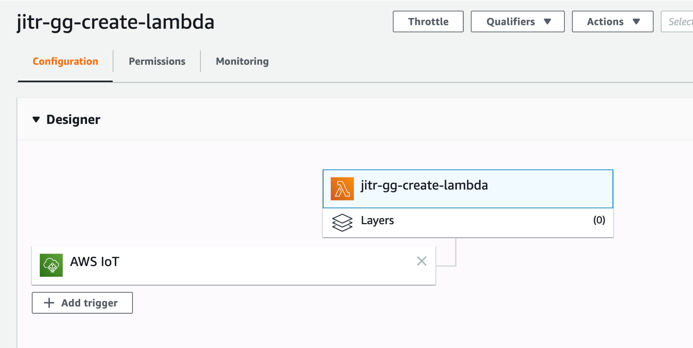


# Install and start greengrass with the certs you've created in **step 3**


Now that the device certs and lambda function and rule is ready, we can now start to enable Greengrass with this setup!

get back to your EC2 terminal:

and you will do the following things:

- download the greengrass sdk and rootCA
- create a config.json file
- move the certs created previously into the greengrass/certs folder
- start greengrass

## download the greengrass sdk

on EC2 terminal, use the following cmd to download the latest greengrass sdk

```
$ wget https://d1onfpft10uf5o.cloudfront.net/greengrass-core/downloads/1.10.0/greengrass-linux-x86-64-1.10.0.tar.gz
```
untar and install it into the OS

```
sudo tar -xzvf greengrass-OS-architecture-1.10.0.tar.gz -C /
```

Download rootCA

```
cd /greengrass/certs/
sudo wget -O root.ca.pem https://www.amazontrust.com/repository/AmazonRootCA1.pem
```

Add ggc_user and ggc_group

```
sudo adduser --system ggc_user
sudo groupadd --system ggc_group
```

check kernel configureation:

```
sudo sysctl -a | grep fs.protected
```
- If hardlinks and softlinks are set to 1, your protections are enabled correctly. if not, use sysctl -p to update it temporory

## create a config.json file

here is the config.json template you will create.

- update **< region >** with the region you are using
- update **< accountId >** with the region your aws account id
- update **< iotHost >** with the iotHost endpoint you are using
- - you can find your endpoint here
    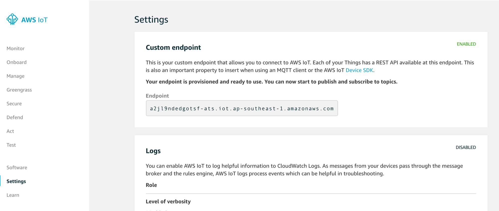


- Also please noted that a thing named **device_jitr_0309_workshop** is will be created by the lambda function, you will need to change it if you've modified the lambda function

```
{
  "coreThing" : {
    "caPath" : "root.ca.pem",
    "certPath" : "jitr.crt",
    "keyPath" : "jitr.key",
    "thingArn" : "arn:aws:iot:<region>:<accountId>:thing/device_jitr_0309_workshop",
    "iotHost" : "<your_iot_endpoint>",
    "ggHost" : "greengrass-ats.iot.<region>.amazonaws.com",
    "keepAlive" : 600
  },
  "runtime" : {
    "cgroup" : {
      "useSystemd" : "yes"
    }
  },
  "managedRespawn" : false,
  "crypto" : {
    "principals" : {
      "SecretsManager" : {
        "privateKeyPath" : "file:///greengrass/certs/jitr.key"
      },
      "IoTCertificate" : {
        "privateKeyPath" : "file:///greengrass/certs/jitr.key",
        "certificatePath" : "file:///greengrass/certs/jitr.crt"
      }
    },
    "caPath" : "file:///greengrass/certs/root.ca.pem"
  }
}
```
1. use vim or your favirote editor to update the config.json on EC2 terminal
2. After updated the config.json, use the following cmd to put it into /greengrass/config/

```
sudo cp config.json /greengrass/config/config.json 
```

You might noticed that the **certPath** and the **keyPath** is using jitr.*, so next step we will change the certs names we've created previously into jitr.*

## move the certs created previously into the greengrass/certs folder

use the following cmd to move the certs into /greengrass/certs on your EC2 termnial

```
cp deviceCertAndCACert.crt jitr.crt; cp deviceCert.key jitr.key; sudo cp jitr* /greengrass/certs/
```

## Start greengrass

now you can start greengrass with the following cmd and verifiy the results later

```
cd /greengrass/ggc/core/
sudo ./greengrassd restart
```

it should sucess message as below

```
Waiting 
Stopped greengrass daemon, exiting with success
Setting up greengrass daemon
Validating hardlink/softlink protection
Waiting for up to 1m10s for Daemon to start

Greengrass successfully started with PID: 20321
```

# Verifiy the group is successfully provisioned and deploy it

check if policy **Policy_device_jitr_0309_workshop** is created

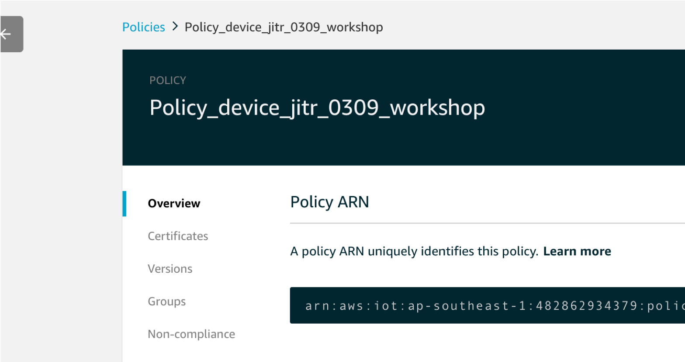

check if thing name **device_jitr_0309_workshop** is created


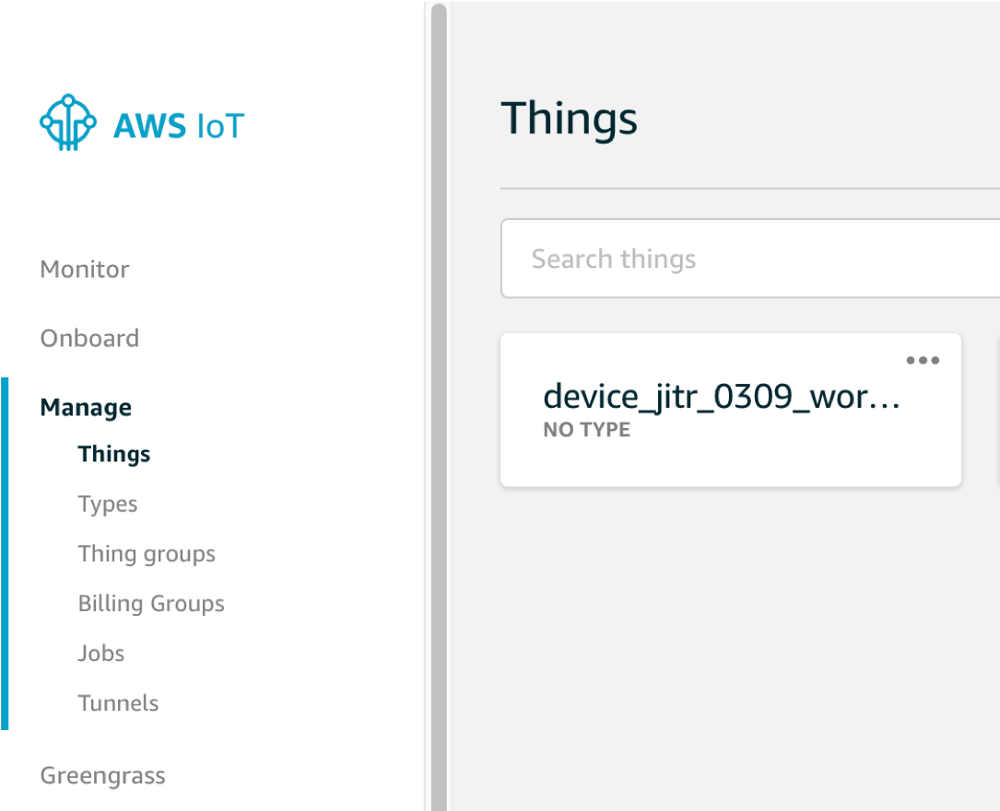

check if greengrass group **jitr_group_device_jitr_0309_workshop** is created

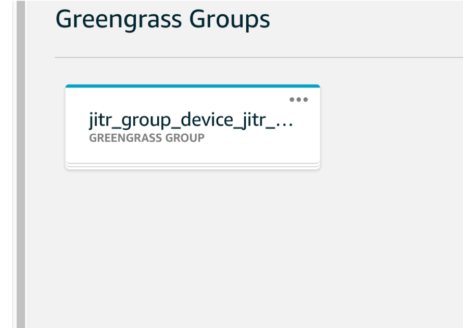

Fianlly deploy the greengrass group and it should deploy successfully

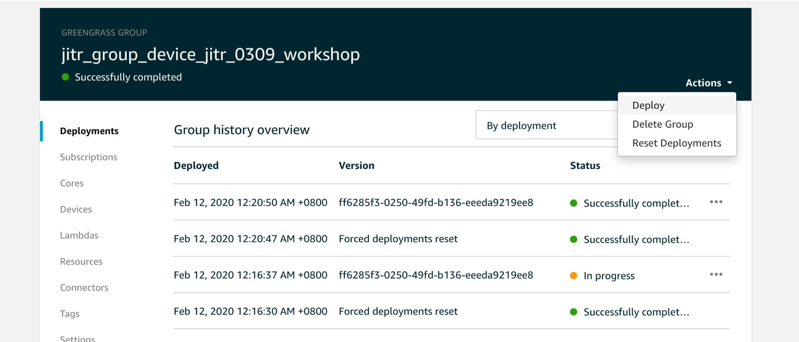