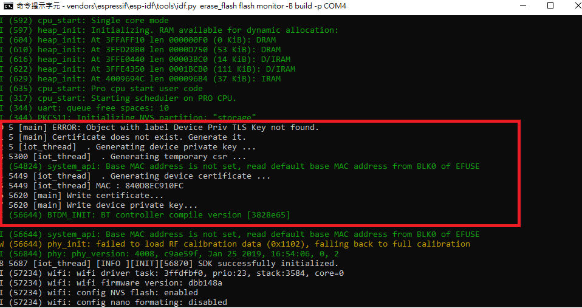

# Just-In-Time Registration (JITR) - Lab 4

In this Lab, you will generate JITR approach 2 related configuration and test the follow of JITR approach 2.


## Prerequisites

1. Download and install aws command line tools. Please add it to system path.
    
    * [32-bit](https://s3.amazonaws.com/aws-cli/AWSCLI32PY3.msi)
    * [64-bit](https://docs.aws.amazon.com/cli/latest/userguide/install-windows.html#install-msi-on-windows)
    

2. Create access key for aws cli. Login to AWS console and search **IAM**. Click **User**→ your account→ **Security credentials**→**create access key.** **Access key ID** and **Secret access key **will be created and they can not be accessed after closing the window. Please download them by click **Download.csv file** and keep them safe.
    

3. After you create access key, follow the command to configure your awl cli. Follow the hit and type your **Access Key ID** , **AWS Secret Access Key** and **Default region name**.
```bash
aws configure
```

4. You can verify your aws cli by following command.
```bash
aws iot describe-endpoint
```

5. Download and install openssl. Please add it to system path.
    * [OPENSSL](https://bintray.com/vszakats/generic/download_file?file_path=openssl-1.1.1d-win64-mingw.zip)


## Architecture

For IoT devices onboarding, JITR approach 2 offers a method that devices could generate device certificate and key automatically. Through IoT Core, rule engine and DynamoDB, it becomes more secure in management and more efficient in certificate/key rotation.


1. Device generates key and certificate based on on-boarded long term CA certificate. This CA should be stored in the secure partition of device.
2. Device connects to AWS IoT Core with the generated key and certificate.
3. Trigger IoT Core Action.
4. Rule engine triggers Lambda.
5. Verify device information with AWS DynamoDB.
6. Lambda creates thing and policy for device.
7. Device connects to AWS IoT Core with the registered key and certificate.


## Generating CA Certificate and Registering to IoT Core

1. Use the following command to generate intermediate CA certificate.
```bash
openssl genrsa -out CA_Private.key 2048
openssl req -x509 -new -nodes -key CA_Private.key -sha256 -days 365 -out CA_Certificate.pem
```
2. Use the following AWS CLI command to acquire a registration code. This command will return a randomly generated, unique registration code that is bound to your AWS account. It does not expire until you delete it. Remember it and it will be needed in the coming step.
```bash
aws iot get-registration-code
```
3. Use the registration code to create a CSR by following command.
```bash
openssl genrsa -out Verification_Private.key 2048
openssl req -new -key Verification_Private.key -out Verification.csr
```
4. During the CSR creation process, you will be prompted for information. Enter the registration code you created above into the **Common Name** field of the verification
    

5. Use CSR that includes the registration code and the first sample CA certificate to generate a new certificate by the following command.
```bash
openssl x509 -req -in Verification.csr -CA CA_Certificate.pem -CAkey CA_Private.key -CAcreateserial -out Verification.crt -days 365 -sha256
```
6. Use the verification certificate to register your sample CA certificate by the following AWS CLI command. This command also enables CA and allows auto-registration. This command will returns CA certificate ID that you would use in the following step.
```bash
aws iot register-ca-certificate --ca-certificate file://CA_Certificate.pem --verification-certificate file://Verification.crt --set-as-active --allow-auto-registration
```
7. You can check it from IoT Core console. Please login to IoT Core console and click **Secure**→**CAs**. You should see the CA certificate ID you just created and registered.
    


## Configure DynamoDB

In this lab, we use device Wi-Fi MAC address as device serial number (DSN). To verify it, we need to create a database in AWS DynamoDB. When device generates the certificate and key, they will be used to connect to IoT core via MQTT over TLS. IoT Core will trigger rule engine and pass device information to a Lambda function. Lambda will verify this information with DynamoDB. If it is valid, Lambda function will create a thing name and policy for this device.

1. Login to AWS console and search **DynamoDB**.
    

2. Click **Create table**.
    

3. In this lab, giving table a name **jitr** in **Table name** and giving a primary key **dsn** in **Primary key**. The type of **Primary key** is **String**, then click **Create**.
    

4. After creating table, browse to tab **Items** → **Create item**.
    

5. Fill **dsn** with your device MAC address and click **Save**.
    


## Configure Lambda

1. Download the sample code for Lambda.
2. Login to AWS management console, search and click **Lambda**.
    

3. In Lambda console, click **Create function**.
    

4. Click **Author from scratch**, giving a function name **jitrDemoFunction**. Select **Python 3.7** and **Create a new role with basic Lambda permissions** in **Choose or create an execution role**. Click **Create function**.
    

5. In **Function code**, choose **Upload a .zip file** then click **Upload** to upload sample code you downloaded.
    

6. Roll down the page to **Execution role** and click **View the jitrDemoFuntion-role-xxxxx** role on the IAM console.
    

7. In IAM console, you would see the role you just created. Click **Edit policy** and paste the following policies. After pasting this policies, click **Review policy** and then click **Save changes**.
```json
{
    "Version": "2012-10-17",
    "Statement": [
        {
            "Effect": "Allow",
            "Action": [
                "logs:CreateLogGroup",
                "logs:CreateLogStream",
                "logs:PutLogEvents"
            ],
            "Resource": "arn:aws:logs:*:*:*"
        },
        {
            "Effect": "Allow",
            "Action": [
                "iot:DetachThingPrincipal",
                "iot:CreateThing",
                "iot:DeleteThing",
                "iot:DetachPolicy",
                "iot:AttachThingPrincipal",
                "iot:DeleteCertificate",
                "iot:AttachPolicy",
                "iot:AttachPrincipalPolicy",
                "iot:DescribeThing",
                "iot:CreatePolicy",
                "iot:DescribeCertificate",
                "iot:ListAttachedPolicies",
                "iot:DeletePolicy",
                "iot:ListPrincipalPolicies",
                "iot:DetachPrincipalPolicy",
                "iot:ListThingPrincipals",
                "iot:UpdateCertificate",
                "iot:ListThings",
                "dynamodb:Scan",
                "dynamodb:BatchGetItem",
                "dynamodb:Query",
                "dynamodb:List*",
                "dynamodb:Describe*",
                "dynamodb:GetItem"
            ],
            "Resource": "*"
        }
    ]
}
```


8. Switch back to Lambda console, click **Save**.


## Configure AWS IoT Rule

1. Login to AWS IoT console and click **Act**→ **Rules**→ **Create**.
    

2. Giving a name and paste the following code to **Rule query statement** where xxxxxxxxx is your CA certificate ID you generated above.
```text
SELECT * FROM '$aws/events/certificates/registered/xxxxxxxxxxxxx'
```

3. Roll down and click **Add action** in **Set one or more actions**.

4. Select **Send a message to a Lambda function** and click **Configure action**.
    

5. Click **Select** and select the Lambda you created above. Click **Add action**→ **Create rule**
    


## Build, flash and test

1. Clone Amazon FreeRTOS for Just-In-Time Registration demonstration.
```bash
git clone https://github.com/aws-tec/jitr-approach2.git
```
2. Before build code, go to folder **jitr-approach2\tools\certificate_configuration** and double click **PEMfileToCString.html**. Please select the **CA_Certificate.pem** you just create above and click **Display formatted PEM stting to be copied inot aws_clientdential_keys.h**. Paste it into filed **keyCLIENT_CERTIFICATE_PEM** in **jitr-approach2\demos\include\aws_clientcredential_keys.h**.
    


3. Please select the **CA_Private.key** you just create above and click **Display formatted PEM stting to be copied inot aws_clientdential_keys.h**. Paste it into filed **keyCLIENT_PRIVATE_KEY_PEM** in **jitr-approach2\demos\include\aws_clientcredential_keys.h**.
    

4. Edit file **jitr-approach2\demos\include\aws_clientcredential.h**. 
    For **clientcredentialMQTT_BROKER_ENDPOINT**, you can get this information in **IoT Core console**→ **Settings**.
    

5. For **clientcredentialWIFI_SSID** and **clientcredentialWIFI_PASSWORD**, you will get customer Wi-Fi information in the class. Please save once you done those modifications.
6. Change directory to source root, use the following command to generate build files.
```bash
cmake -DVENDOR=espressif -DBOARD=esp32_devkitc -DCOMPILER=xtensa-esp32  -GNinja -S . -B build\
```
7. Change directory to **jitr-approach2\build**, use the following command to build code.
```shell    
ninja
```
8. Change directory to source root. Now flash and monitor the device status with the following command. It will output in both local console and in IoT Core test monitor. Where **COM4** is depending on your PC.
```bash
vendors\espressif\esp-idf\tools\idf.py erase_flash flash monitor -B build -p COM4
```
9. First the device will generate key and certificate and try to use this pair to connect to AWS IoT Core. It would fail at first trial. After Lambda’s verification with DynamoDB, Lambda will create a new policy and thing for this device. Later this device would connect to AWS IoT core successfully.
    


