# Just-In-Time Registration (JITR) - Lab 4

In this Lab, you will generate JITR approach 2 related configuration and test the follow of JITR approach 2.

## Prerequisites

1. AWS Cloud9 environment and install the building package as Lab0 indicates.
2. Clone the sample package from [aws-iot-device-auto-provisioning-approach](aws-iot-device-auto-provisioning-approach).

## Architecture

For IoT devices onboarding, JITR approach 2 offers a method that devices could generate device certificate and key automatically. Through IoT Core, rule engine and DynamoDB, it becomes more secure in management and more efficient in certificate/key rotation.


1. Device generates key and certificate based on on-boarded long term CA certificate. This CA should be stored in the secure partition of device.
2. Device connects to AWS IoT Core with the generated key and certificate.
3. Trigger IoT Core Action.
4. Rule engine triggers Lambda.
5. Verify device information with AWS DynamoDB.
6. Lambda creates thing and policy for device.
7. Device connects to AWS IoT Core with the registered key and certificate.

## Generating CA Certificate and Registering to IoT Core

1. Use the following command to generate intermediate CA certificate.

    ```bash
    cd ~/environment
    mkdir CAs
    cd CAs/
    openssl genrsa -out CA_Private.key 2048
    openssl req -x509 -new -nodes -key CA_Private.key -sha256 -days 365 -out CA_Certificate.pem
    ```

2. Use the following AWS CLI command to acquire a registration code. This command will return a randomly generated, unique registration code that is bound to your AWS account. It does not expire until you delete it. Remember it and it will be needed in the coming step.

    ```bash
    aws iot get-registration-code
    ```

3. Use the registration code to create a CSR by following command.

    ```bash
    openssl genrsa -out Verification_Private.key 2048
    openssl req -new -key Verification_Private.key -out Verification.csr
    ```

4. During the CSR creation process, you will be prompted for information. Enter the registration code you created above into the **Common Name** field of the verification

    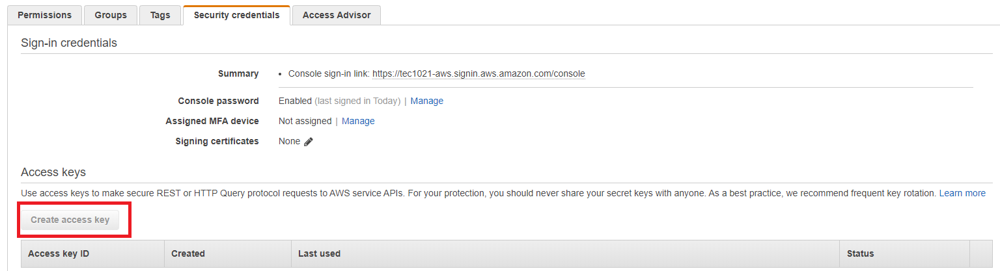
5. Use CSR that includes the registration code and the first sample CA certificate to generate a new certificate by the following command.

    ```bash
    openssl x509 -req -in Verification.csr -CA CA_Certificate.pem -CAkey CA_Private.key -CAcreateserial -out Verification.crt -days 365 -sha256
    ```

6. Use the verification certificate to register your sample CA certificate by the following AWS CLI command. This command also enables CA and allows auto-registration. This command will returns CA certificate ID that you would use in the following step.

    ```bash
    aws iot register-ca-certificate --ca-certificate file://CA_Certificate.pem --verification-certificate file://Verification.crt --set-as-active --allow-auto-registration
    ```

7. You can check it from IoT Core console. Please login to IoT Core console and click **Secure**→**CAs**. You should see the CA certificate ID you just created and registered.

    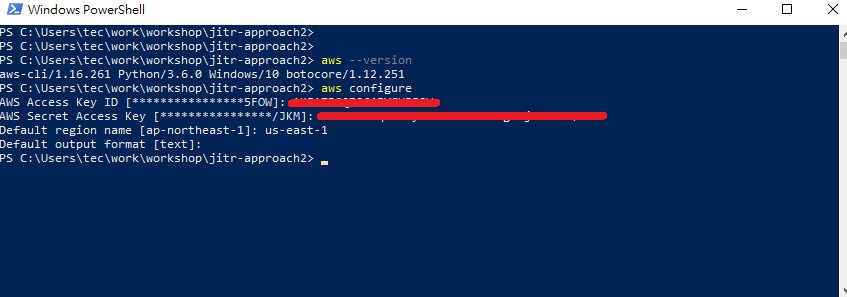

## Configure DynamoDB

In this lab, we use device Wi-Fi MAC address as device serial number (DSN). To verify it, we need to create a database in AWS DynamoDB. When device generates the certificate and key, they will be used to connect to IoT core via MQTT over TLS. IoT Core will trigger rule engine and pass device information to a Lambda function. Lambda will verify this information with DynamoDB. If it is valid, Lambda function will create a thing name and policy for this device.

1. Login to AWS console and search **DynamoDB**.

    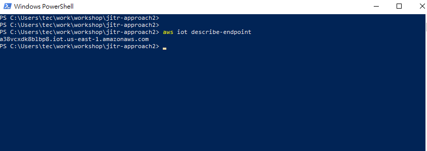
2. Click **Create table**.

    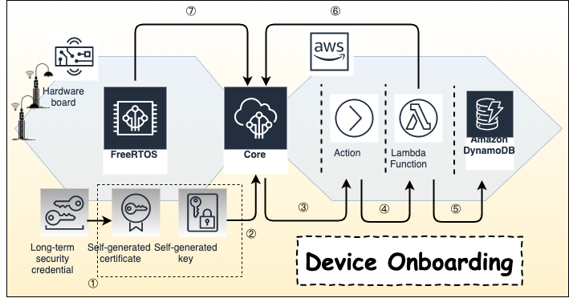
3. In this lab, giving table a name **jitr** in **Table name** and giving a primary key **dsn** in **Primary key**. The type of **Primary key** is **String**, then click **Create**.

    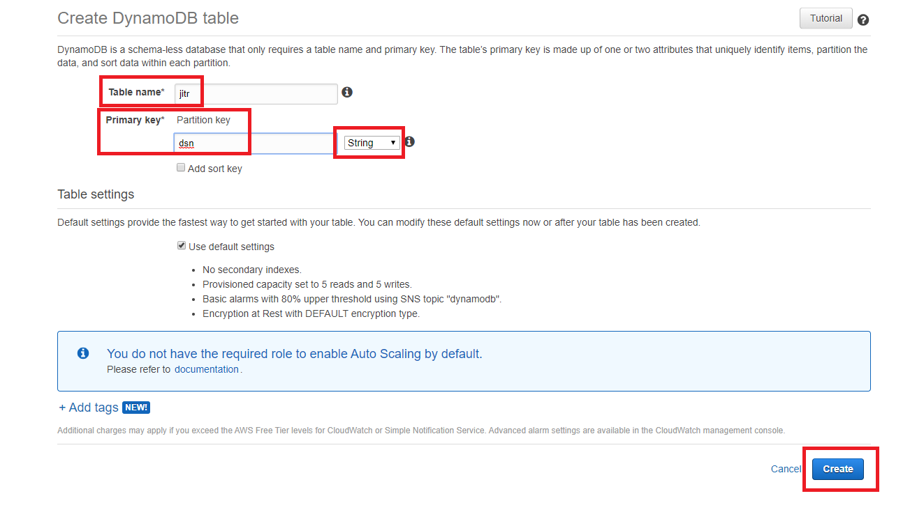
4. After creating table, browse to tab **Items** → **Create item**.

    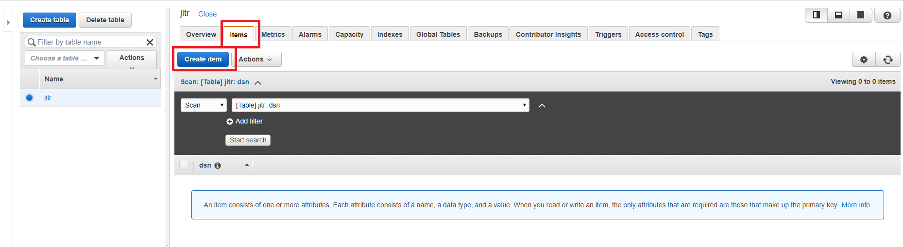
5. Fill **dsn** with your device MAC address and click **Save**.

    

## Configure Lambda

1. Clone the sample code for github. Modify the region definition in lambda_function.py and then pack it.

    ```bash
    cd ~/environment
    git clone https://github.com/aws-samples/aws-iot-device-auto-provisioning-approach.git
    cd aws-iot-device-auto-provisioning-approach/lambda/
    vim lambda_function.py
    pip install -t ./ -r requirements.txt
    zip -r jitrSampleFunction.zip * .[^.]*
    ```

2. Download jitrSampleFunction.zip from AWS Cloud9.

3. Login to AWS management console, search and click **Lambda**.

    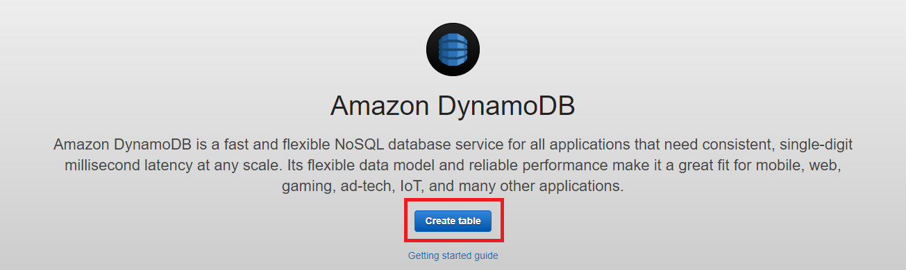
4. In Lambda console, click **Create function**.

    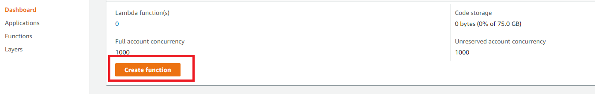
5. Click **Author from scratch**, giving a function name **jitrDemoFunction**. Select **Python 3.6** and **Create a new role with basic Lambda permissions** in **Choose or create an execution role**. Click **Create function**.

    
6. In **Function code**, choose **Upload a .zip file** then click **Upload** to upload sample code you downloaded.

    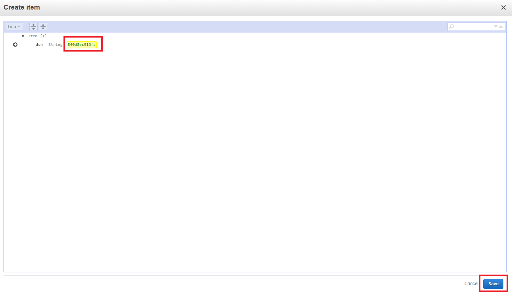
7. Roll down the page to **Execution role** and click **View the jitrDemoFuntion-role-xxxxx** role on the IAM console.

    
8. In IAM console, you would see the role you just created. Click **Edit policy** and paste the following policies. After pasting this policies, click **Review policy** and then click **Save changes**.

    ```json
    {
        "Version": "2012-10-17",
        "Statement": [
            {
                "Effect": "Allow",
                "Action": [
                    "logs:CreateLogGroup",
                    "logs:CreateLogStream",
                    "logs:PutLogEvents"
                ],
                "Resource": "arn:aws:logs:*:*:*"
            },
            {
                "Effect": "Allow",
                "Action": [
                    "iot:DetachThingPrincipal",
                    "iot:CreateThing",
                    "iot:DeleteThing",
                    "iot:DetachPolicy",
                    "iot:AttachThingPrincipal",
                    "iot:DeleteCertificate",
                    "iot:AttachPolicy",
                    "iot:AttachPrincipalPolicy",
                    "iot:DescribeThing",
                    "iot:CreatePolicy",
                    "iot:DescribeCertificate",
                    "iot:ListAttachedPolicies",
                    "iot:DeletePolicy",
                    "iot:ListPrincipalPolicies",
                    "iot:DetachPrincipalPolicy",
                    "iot:ListThingPrincipals",
                    "iot:UpdateCertificate",
                    "iot:ListThings",
                    "dynamodb:Scan",
                    "dynamodb:BatchGetItem",
                    "dynamodb:Query",
                    "dynamodb:List*",
                    "dynamodb:Describe*",
                    "dynamodb:GetItem"
                ],
                "Resource": "*"
            }
        ]
    }
    ```

    
    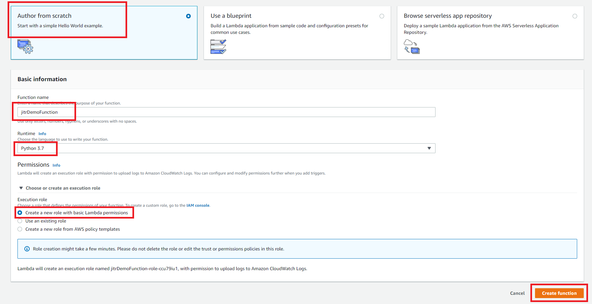
9. Switch back to Lambda console, click **Save**.
    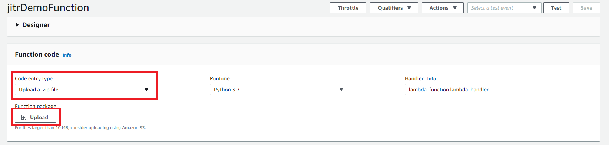

## Configure AWS IoT Rule

1. Login to AWS IoT console and click **Act**→ **Rules**→ **Create**.

    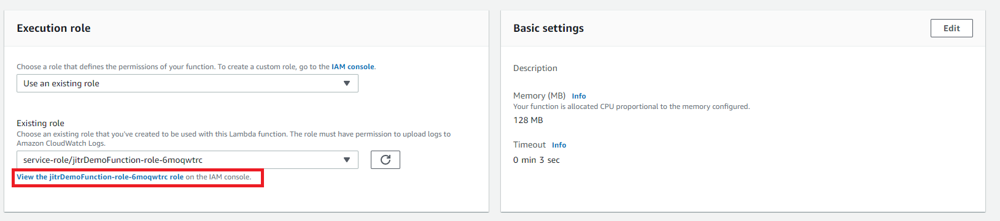
2. Giving a name and paste the following code to **Rule query statement** where xxxxxxxxx is your CA certificate ID you generated above.

    ```text
    SELECT * FROM '$aws/events/certificates/registered/xxxxxxxxxxxxx'
    ```

    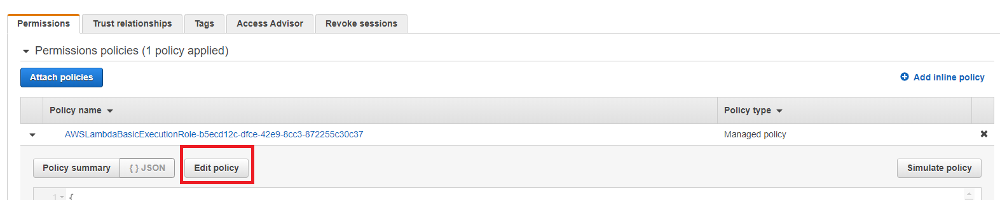
3. Roll down and click **Add action** in **Set one or more actions**.
    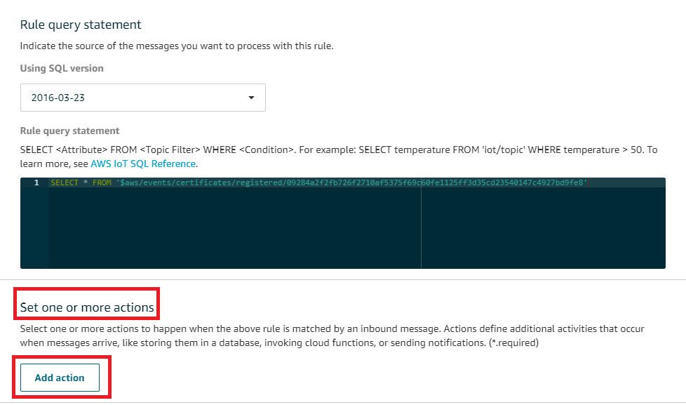
4. Select **Send a message to a Lambda function** and click **Configure action**.

    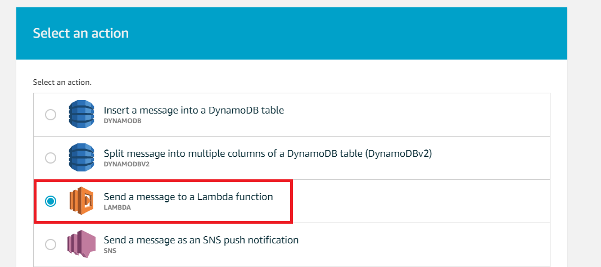
5. Click **Select** and select the Lambda you created above. Click **Add action**→ **Create rule**

    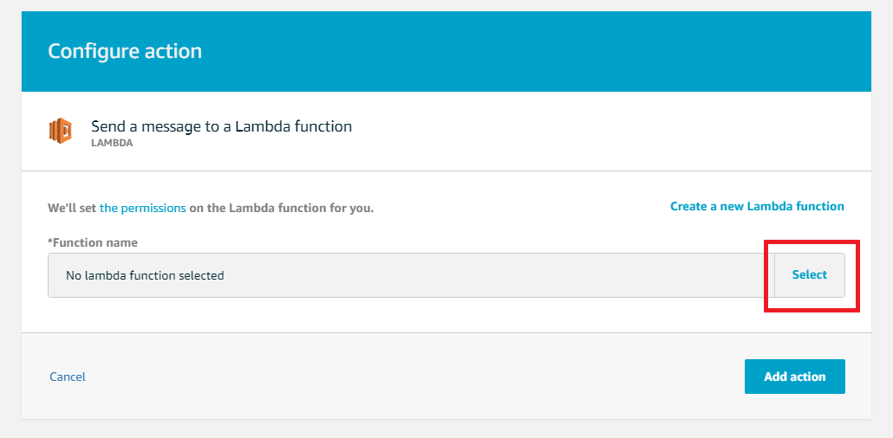
    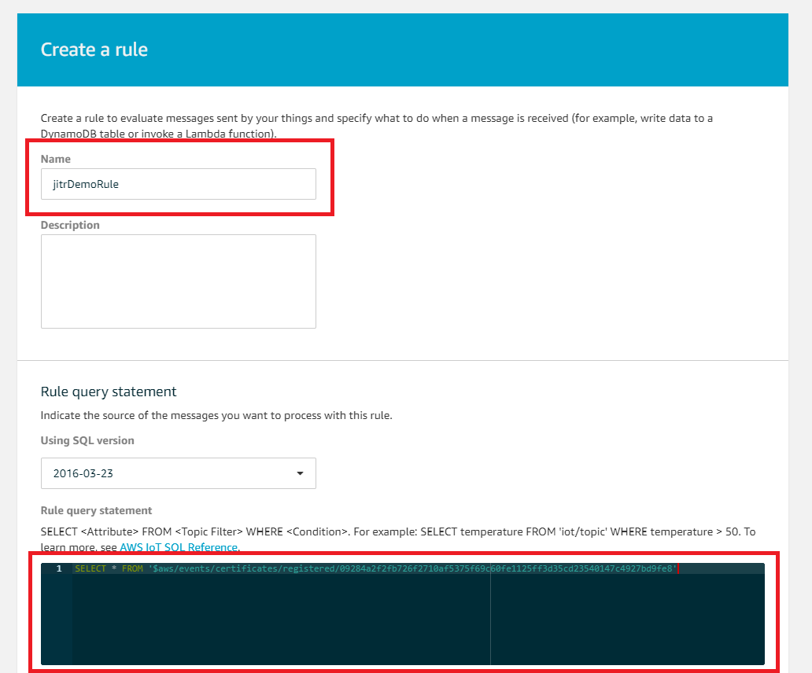

## Build, flash

1. Clone Amazon FreeRTOS and patch for Just-In-Time Registration demonstration.

    ```bash
    cd ~/environment/aws-iot-device-auto-provisioning-approach/amazon-freertos/
    git clone https://github.com/aws/amazon-freertos.git
    cd amazon-freertos/
    git checkout 201906.00_Major -b auto-provisioning
    git am ../0001-Add-IoT-Lab-Workshop-Device-Auto-Provision-sample-co.patch
    ```

2. Before build code, Download the CAs certificate, private key and tools folder from Cloud9. Use **PEMfileToCString.html** to generate C string. Please select the **CA_Certificate.pem** you just create above and click **Display formatted PEM stting to be copied into aws_clientdential_keys.h**. Paste it into filed **keyJITR_DEVICE_CERTIFICATE_AUTHORITY_PEM** in **~/environment/aws-iot-device-auto-provisioning-approach/amazon-freertos/amazon-freertos/demos/include/aws_clientcredential_keys.h**.

    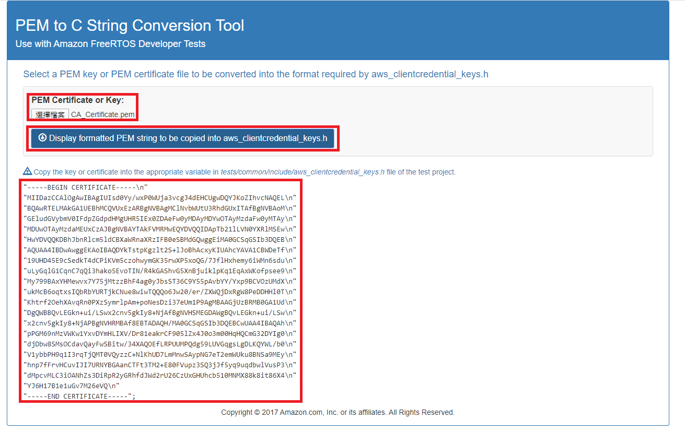
    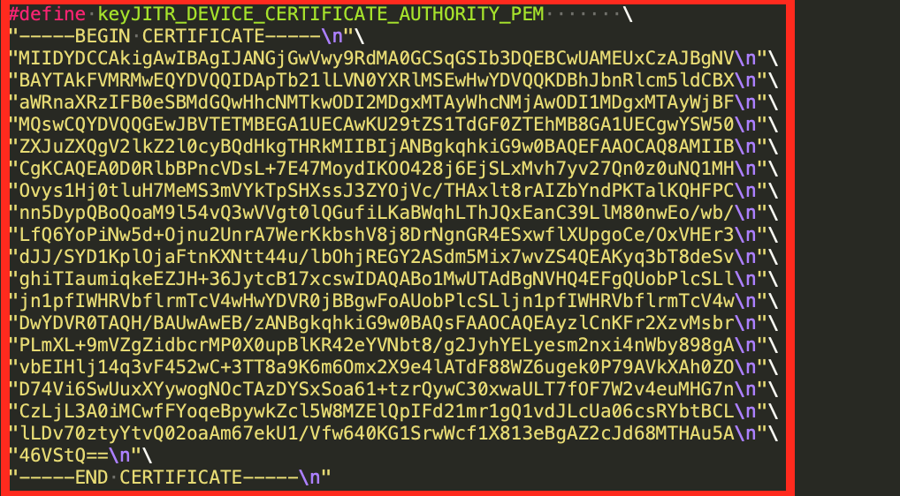
3. Please select the **CA_Private.key** you just create above and click **Display formatted PEM stting to be copied into aws_clientdential_keys.h**. Paste it into filed **keyJITR_DEVICE_CERTIFICATE_AUTHORITY_KEY_PEM** in **~/environment/aws-iot-device-auto-provisioning-approach/amazon-freertos/amazon-freertos/demos/include/aws_clientcredential_keys.h**.

    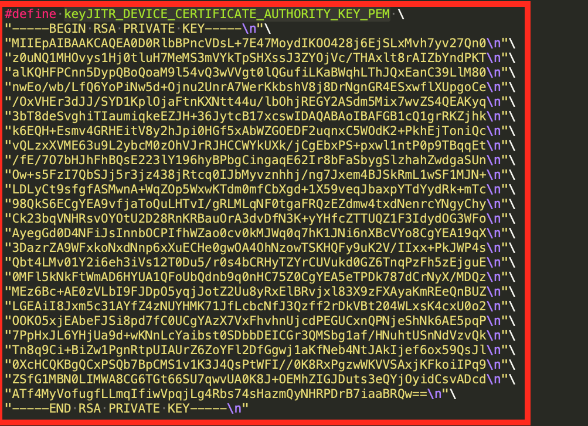
4. Edit file **~/environment/aws-iot-device-auto-provisioning-approach/amazon-freertos/amazon-freertos/demos/include/aws_clientcredential.h**.
    For **clientcredentialMQTT_BROKER_ENDPOINT**, you can get this information in **IoT Core console**→ **Settings**.

    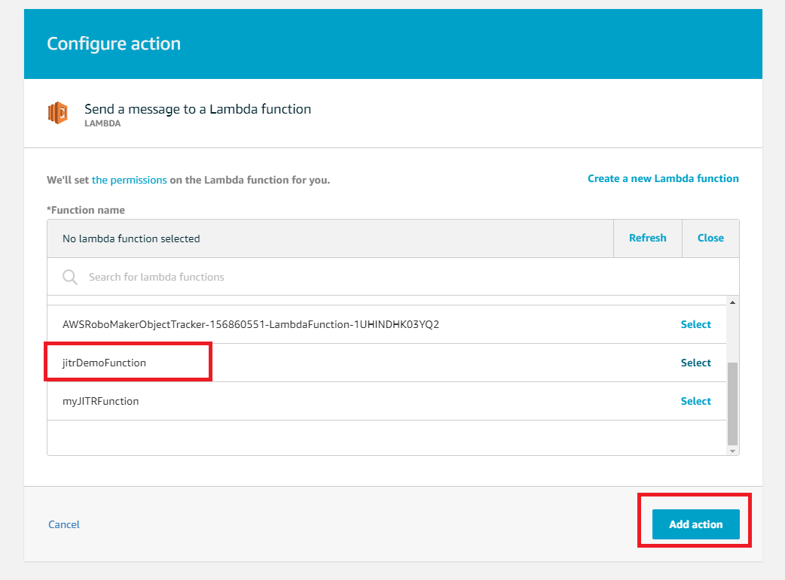
5. For **clientcredentialWIFI_SSID** and **clientcredentialWIFI_PASSWORD**, you will get customer Wi-Fi information in the class. Please save once you done those modifications.
6. Change directory to **~/environment/aws-iot-device-auto-provisioning-approach/amazon-freertos/amazon-freertos/vendors/espressif/boards/esp32/aws_demos**, use the following command to build code.

    ```shell
    make all -j4
    ```

7. Download the image from AWS Cloud9.
    - build/aws_demo.bin
    - build/partition-table.bin
    - build/bootloader/bootloader.bin
8. Follow the command to flash and monitor device as Lab0 indicates.

## Verification and Test

1. The device will generate key and certificate at the first boot. You can check the log from console.

    
2. Login to AWS IoT Core console and click **Test**. Fill **Subscription topic** in **#** and click **Subscribe the topic**.

    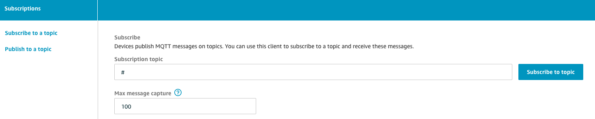

3. The device will use this pair to connect to AWS IoT Core. It would fail at first time and wait Lambda to verify with DynamoDB. After a few second, the device will try to connect to AWS IoT Core again. You can check the MQTT message sended by the device.

    

4. Login to AWS IoT Core console and click **Secure**→**Certificates**. You are supposed to see a new certificate generated from your device.

    
