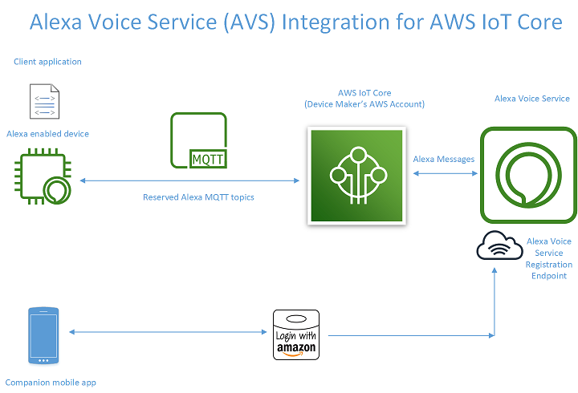
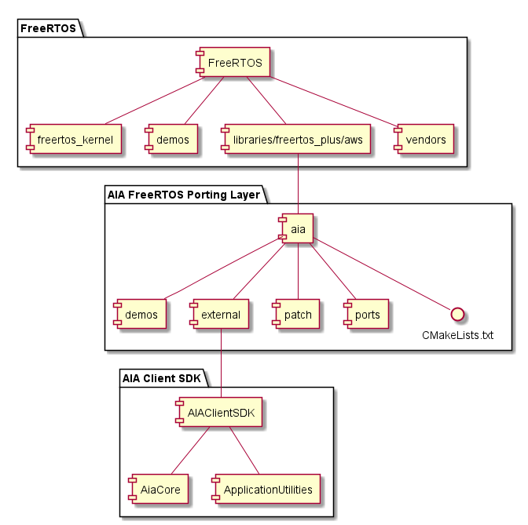
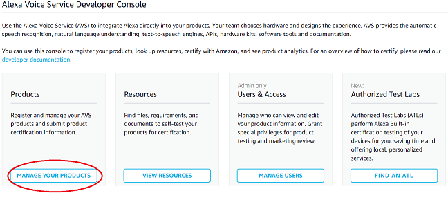
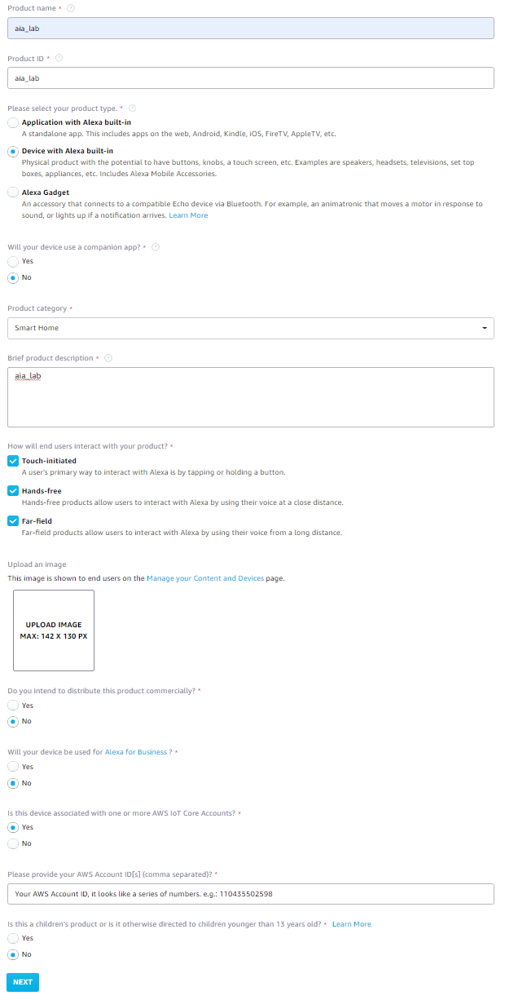
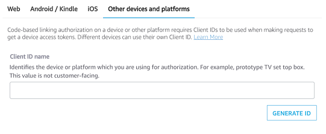
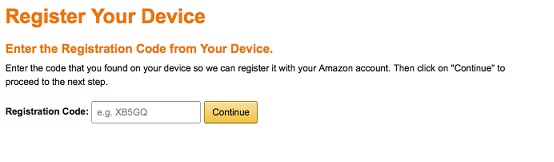
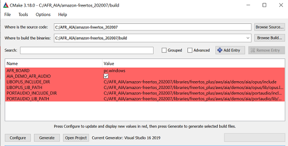
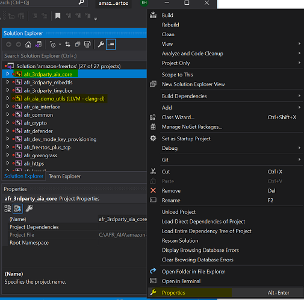
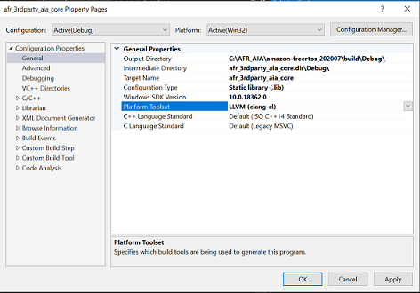
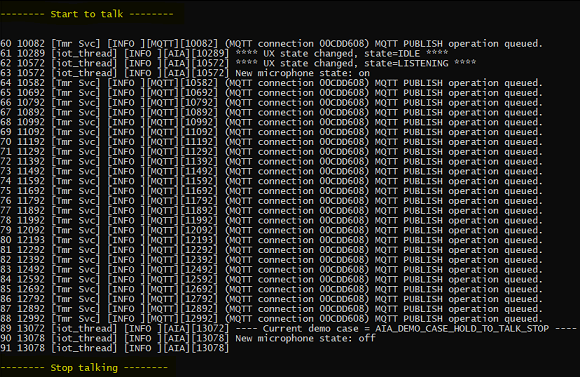

# Lab 5: Alexa Voice Service Integration for AWS IoT on FreeRTOS #

> Alexa Voice Service Integration for AWS IoT (AIA) is a new feature that cost-effectively brings Alexa Voice to any connected device without incurring messaging costs. This feature leverages AWS IoT to offload intensive computational and memory audio tasks from the device to the cloud, so device makers can now cost-effectively bring Alexa to resource-constrained IoT devices and make it possible for consumers to talk directly to Alexa in parts of their home, office, or hotel rooms for an ambient experience.



This laboratory demonstrates AIA hold-to-talk on FreeRTOS, we use Windows simulator platform here.

It requires three main repositories in this laboratory:

* **[FreeRTOS](https://github.com/aws/amazon-freertos)**: This is the official FreeRTOS IoT Reference Integration package. You can download it from AWS GitHub.
* **[AIA FreeRTOS Porting Kit](https://github.com/aws-samples/alexa-voice-service-integration-for-aws-iot-freertos-porting-kit)**: A complete implementation, including implementation of the porting layer on FreeRTOS, and a demo application that performs AIA registration and Alexa interactions, is provided for the Windows Simulator target of FreeRTOS. You can use it as a template for porting to embedded hardware platforms of FreeRTOS. It does not contain the AIA Client SDK, but when you clone this project, Git helps to download the AIA Client SDK as a sub-module.
* **[AIA Client SDK](https://github.com/alexa/AIAClientSDK)**: The SDK implements AIA protocols and core functions. You can find the AIA backend API document [here](https://developer.amazon.com/en-US/docs/alexa/alexa-voice-service/avs-for-aws-iot-overview.html).



We will go through the following steps to finish AFI demonstration in this laboratory:

1. Get a refresh token for AIA registration
2. Download and build AFI projects
3. Run a sample to demonstrate AIA hold-to-talk

## Prerequisite ##

> This laboratory assumes that you had finished Lab 0 and knows the basic configuration and build flow of FreeRTOS.

On your Windows machine:

   1. Install the latest version of [WinPCap](https://www.winpcap.org/).
   2. Install [Microsoft Visual Studio](https://www.visualstudio.com/downloads).
      * In addition to the IDE, install the `Desktop development with C++ component`.
      * Install the `latest Windows 10 SDK`. You can choose this under the Optional section of the Desktop development with C++ component.
      * Install the `C++ Clang tools for Windows`. You can choose this under the Optional section of the Desktop development with C++ component.
   3. Install [CMake for Windows](https://cmake.org/download/).
   4. You need to have an AWS account to access AWS IoT Core. [Create](https://portal.aws.amazon.com/billing/signup#/start) one if you don't have it
   5. You need an [Amazon Developer Account](https://developer.amazon.com/). Create one if you don't have it.

## Get a refresh token ##

> Before you can build and run, you need to register with AVS and obtain a refresh token.

1. Create an **`AVS_PRODUCT_ID`** in [here](https://developer.amazon.com/alexa/console/avs/home).

    

    

2. Generate **`AVS_CLIENT_ID`** from the AVS console, the **`AVS_CLIENT_ID`** is in AVS console → Security Profile → Other devices and platforms

    

3. Get **`USER_CODE`** and **`DEVICE_CODE`** by cURL
   * Replace **`AVS_CLIENT_ID`** and **`AVS_PRODUCT_ID`** by yours in the command below
   * Define a unique ID as your device serial number, use it in place of the **`YOUR_DSN`** below

        ```sh
        curl -k -d'response_type=device_code&client_id=AVS_CLIENT_ID&scope=alexa%3Aall&scope_data=%7B%22alexa%3Aall%22%3A%7B%22productID%22%3A%22AVS_PRODUCT_ID%22%22productInstanceAttributes%22%3A%7B%22deviceSerialNumber%22%3A%22YOUR_DSN%22%7D%7D%7D'-H"Content-Type: application/x-www-form-urlencoded"-X POST https://api.amazon.com/auth/O2/create/codepair
        ```

   * You will get **`USER_CODE`** and **`DEVICE_CODE`** from the response.

4. Sign into <https://amazon.com/us/code>, fill in the **`USER_CODE`** returned by previous command

    

5. Get **`REFRESH_TOKEN`** by cURL
    * Replace the **`DEVICE_CODE`** and **`USER_CODE`** in the command below
    * You will get a **`REFRESH_TOKEN`** from the response, you'll need this later.

        ```sh
        curl 'https://api.amazon.com/auth/O2/token' -H "Content-Type: application/x-www-form-urlencoded" -X POST -d 'grant_type=device_code&device_code=DEVICE_CODE&user_code=USER_CODE'
        ```

## Build AFI ##

1. Download *FreeRTOS* from [GitHub](https://github.com/aws/amazon-freertos). The latest version of this project has been integrated with version **`202007.00`**.

   ```sh
   git clone https://github.com/aws/amazon-freertos.git --recurse-submodules
   cd amazon-freertos
   git checkout 202007.00
   ```

2. Download AFI kit under the $AFR_SRC_DIR/libraries/freertos_plus/aws/aia directory, and the **[AIA Client SDK](https://github.com/alexa/AIAClientSDK)** will be downloaded automatically in libraries/freertos_plus/aws/aia/external/AIAClientSDK

    ```sh
    pushd libraries/freertos_plus/aws
    git clone https://github.com/aws-samples/alexa-voice-service-integration-for-aws-iot-freertos-porting-kit.git aia --recurse-submodules
    ```

3. At the current versions, there are some modifications needed in both the AIA Client SDK and FreeRTOS in order to make them work together. We are working with the SDK team and FreeRTOS team to upstream the needed changes. For now, please apply patches using the commands below.
   * Patch Freertos

        ```sh
        popd
        git apply libraries/freertos_plus/aws/aia/patch/freertos_20200700_4e8219e0.patch
        ```

   * Patch the AIA Client SDK

        ```sh
        pushd libraries/freertos_plus/aws/aia/external/AIAClientSDK
        git apply ../../patch/AiaClientSDK_0deab3e0.patch
        popd
        ```

4. Configure AWS IoT for FreeRTOS Demos
   * Fill credential information in demos/include/aws_clientcredential.h and $AFR_SRC_DIR/demos/include/aws_clientcredential_keys.h
   * For more details, please follow [AWS FreeRTOS documentation](https://docs.aws.amazon.com/freertos/latest/userguide/freertos-prereqs.html)

5. Build FreeRTOS for the selected target.
    * Config Log-In with Amazon (LWA) for registration.
      * Modify **libraries/freertos_plus/aws/aia/demos/aia/aia_sample_app.c**
        * Fill your **`AWS_Account_ID`** in **AIA_REG_HTTPS_AWS_ACCOUNT_ID**
        * Fill your **`AVS_CLIENT_ID`** in **AIA_REG_HTTPS_LWA_CLIENT_ID** *(obtained in step #2 of **Get a refresh token** session above)*
        * Fill your LWA **`REFRESH_TOKEN`** in **AIA_REG_HTTPS_LWA_REFRESH_TOKEN** *(obtained in step #5 of **Get a refresh token** session above*
      * Select to build AIA demo by editing **vendors/pc/boards/windows/aws_demos/config_files/aws_demo_config.h**
        * Enable AIA demo by **#define CONFIG_AIA_DEMO_ENABLED**
    * Build the Windows Simulator target.
      * Follow the [tutorial](https://docs.aws.amazon.com/freertos/latest/userguide/getting_started_windows.html) to build FreeRTOS Windows simulator.
        * Please follow **Building and running the FreeRTOS demo project with CMake** session of the tutorial.
        * To `build microphone/speaker audio functionalities` for the demo app on Windows simulator:
          * The demo app on Windows Simulator uses **[PortAudio](http://www.portaudio.com/archives/pa_stable_v190600_20161030.tgz)** and **[Opus](https://github.com/xiph/opus)**.
          * Set a bool value **AIA_DEMO_AFR_AUDIO=true** in CMake entry to enable audio
          * Download and build static libraries for both PortAudio and Opus on the Windows platform by yourself, and specify include path and libraries path for CMake entry
            * We also prepared pre-built Opus and PortAudio libraries for workshop attendees, the download link will be provided
            * **LIBOPUS_INCLUDE_DIR**=path_to_libopus_include_directory
            * **LIBOPUS_LIB_PATH**=path_to_opus.lib_that_is_built_by_you
            * **PORTAUDIO_INCLUDE_DIR**=path_to_portaudio_include_directory
            * **PORTAUDIO_LIB_PATH**=path_to_portaudio.lib_(static)_that_is_built_by_you

                

          * Click `Configure` to update the setting, then click `Generate` to create Visual Studio Projects

            

        * Click `Open Project` to open Visual Studio.
          * Because the AIA Client SDK requires C99 support, select **`LLVM (clang-cl)`** as the platform toolset for **afr_3rdparty_aia_core** and **afr_aia_demo_utils** projects in Microsoft Visual Studio.

            

            

        * To build AIA hold-to-talk sample, please un-comment **`#define AIA_DEMO_AUDIO_ENABLE`** in libraries/freertos_plus/aws/aia/demos/aia/aia_sample_app.c
          * Click `Local Windows Debugger` on Visual Studio to build and run the sample
          * If you have the problem of `'_serialize': intrinsic function, cannot be defined` when building **afr_defender**, please also select **LLVM (clang-cl)** as the platform toolset for **afr_defender**.

## Run the Sample ##



* Connect microphone and speaker to your Windows platform
* Update the macro **`configNETWORK_INTERFACE_TO_USE`** in vendor/pc/board/windows/aws_demos/config_files/FreeRTOSConfig.h by your network setting at run time
* At run time, you can talk with Alexa when seeing **Start to talk** on console output.
* The sample app runs a sequential flow to demonstrate microphone hold-to-talk.
* The program will wait 2.5 seconds for user to start talking.
* The program will wait 7 seconds for AVS response.
